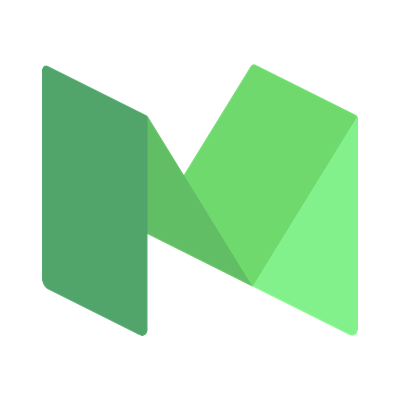
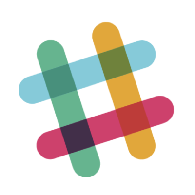

# About Women Who Code Portland

## Who We Are

We are the Portland chapter of Women Who Code. Women Who Code (WWCode) is a U.S. based 501(c)(3) non-profit dedicated to inspiring women to excel in technology careers. We connect amazing women with other like-minded individuals around the globe who unite under one simple notion – the world of technology is much better with women in it.

* More about us [here](http://womenwhocode.com/portland)
* Our events are listed on [Meetup](http://www.meetup.com/Women-Who-Code-Portland/)

## Our Events
We host regular events, which can be found on our Meetup page.

* [Networking Nights](https://github.com/wwcodeportland/networking-nights) - monthly women's speakers series in Portland
* [Study Nights](https://github.com/wwcodeportland/study-nights) - regular study nights focused on JavaScript, DevOps, Design + Product , and Algorithms.
* [Workshops](https://github.com/wwcodeportland/workshops) - workshops on various subjects, including iOS, Android, command line, contributing to open source, security, cryptocurrencies, Agile development, and much more.
* Community Events - various social events, such as viewings of Hidden Figures, happy hours, women who strength train, and more
* [IoT Hackathon](https://github.com/wwcodeportland/iot-hackathon-2016) - a yearly weekend hackathon focused on teaching and exposing our members to hardware and the Internet of Things.

## Leadership Team

* Caterina - Director
* Richa - Director
* Sarah Joy - JavaScript Lead
* Shiyuan - Design Lead
* Tricia - DevOps Lead
* Alia - Algorithms Lead
* Keeley - Open Source Lead
* Michelle - Networking Nights Team
* Haley - JavaScript Co-Lead
* Allison - Slack Program Manager
* Molly - Design Co-Lead
* Meghane - Algorithms Co-Lead
* Posey - Community Engagement Lead
* Alexis - DevOps Co-Lead

## Find Us Online

 [@wwcodeportland](http://twitter.com/wwcodeportland) - use the hashtags: **#wwcode** 

 [@wwcodeportland](http://instagram.com/wwcodeportland)

 [@wwcodeportland](http://medium.com/@wwcodeportland)

 [@wwcodeportland](http://github.com/wwcodeportland)

 [Join our community: bit.ly/wwcpdx-slack](http://bit.ly/wwcpdx-slack)

## Sponsors
Thank you for our wonderful sponsors! We could not run this organization without you.

### 2017 Sponsors

  
 
 
 

 
 
 

### 2016 Sponsors

  

