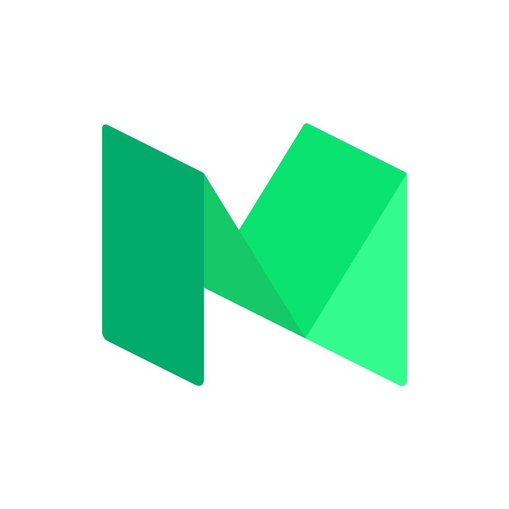
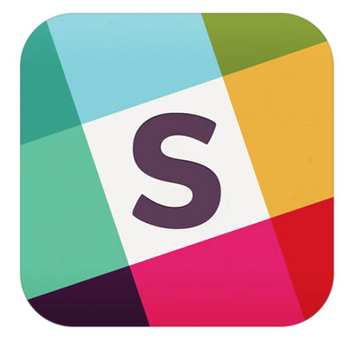

# About Women Who Code Portland

## Who We Are
We are the Portland chapter of Women Who Code. Women Who Code (WWCode) is a U.S. based 501(c)(3) non-profit dedicated to inspiring women to excel in technology careers. We connect amazing women with other like minded amazing women around the globe who unite under one simple notion – the world of technology is much better with women in it.
* More about us [here](http://womenwhocode.com/portland)
* Our events are listed on [Meetup](http://www.meetup.com/Women-Who-Code-Portland/)

## Our Events
We host regular events, which can be found on our Meetup page.

* [Networking Nights](https://github.com/wwcodeportland/networking-nights) - monthly women's speakers series in Portland
* [Study Nights](https://github.com/wwcodeportland/study-nights) - regular study nights focused on JavaScript, DevOps, Algorithms and Interview Prep, Big Data, and Design.
* [Workshops](https://github.com/wwcodeportland/workshops) - workshops on various subjects, including iOS, Android, React Native, and 
* Social Events

## Leadership

* Caterina - Director
* Paige - Founder (currently inactive)
* Sabina  - Event Lead
* Richa - Skills Development Lead
* Amara - Community Lead
* Sarah Joy - JavaScript Lead
* Shiyuan - Design Lead
* Tricia - DevOps Lead

## Find Us

 
 

 

 Twitter: [@wwcodeportland](http://twitter.com/wwcodeportland) 
 Medium: [@wwcodeportland](http://medium.com/@wwcodeportland)
 Github: [@wwcodeportland](http://github.com/wwcodeportland)
 Slack: [sign up here](http://bit.ly/28SvZLC)

* Twitter: [@wwcodeportland](http://twitter.com/wwcodeportland) - use the hashtags: **wwcode** and **#wwcodepdx**
* Medium: [@wwcodeportland](http://medium.com/@wwcodeportland)
* Github: [@wwcodeportland](http://github.com/wwcodeportland)
* Slack: [sign up here](http://bit.ly/28SvZLC)

## 2016 Sponsors
Thank you for our wonderful sponsors! We could not run this organization without you.

<alt="Airbnb">
<alt="Intel">
<alt="Nike">
<alt="New Relic">

## 2015 Sponsors

<alt="New Relic">
